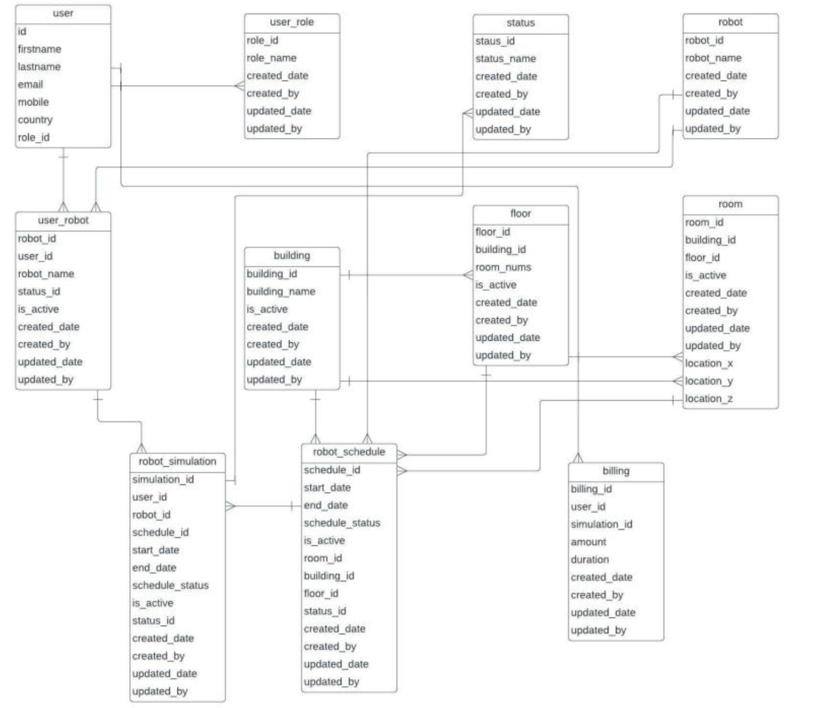
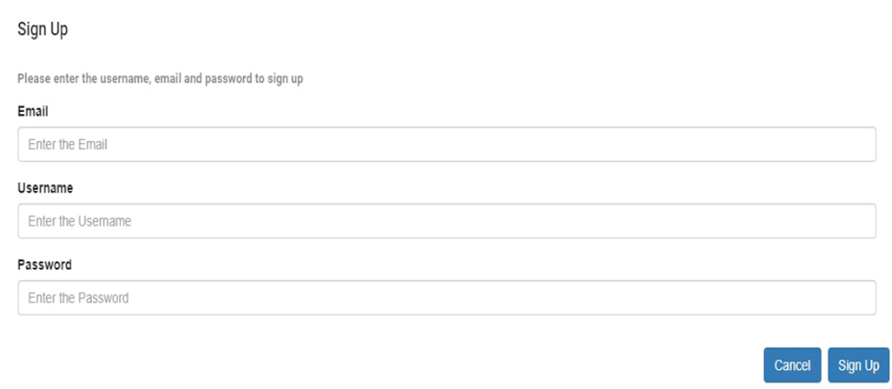
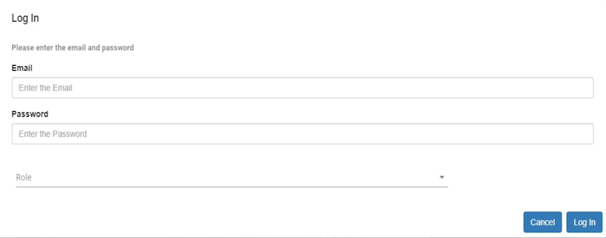
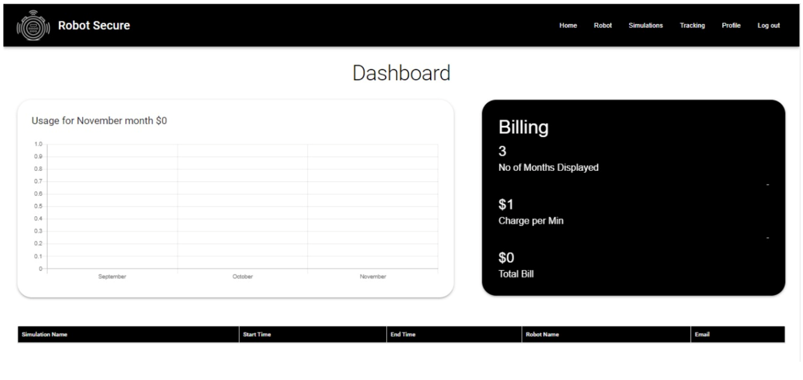
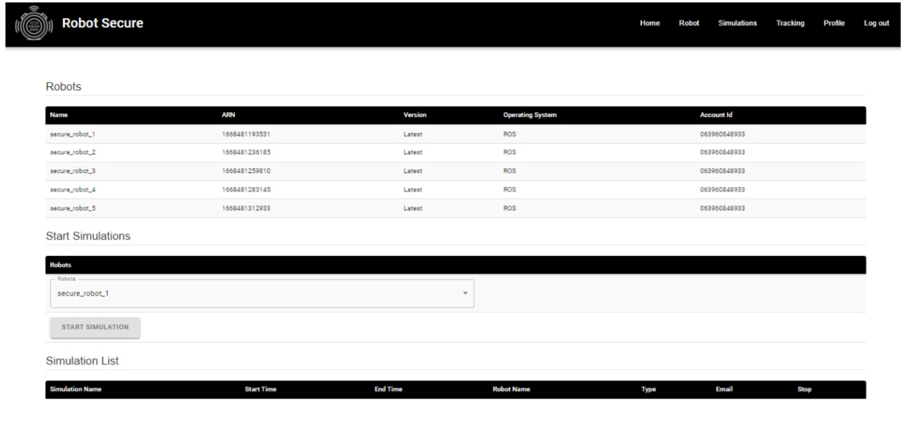

# Security Robot
<p> The objective of the project is to integrate Amazon Web Services (AWS) Robomaker with a web application. This integration will allow users to control the robot through the web interface, which is deployed in the AWS Elastic Compute Cloud (EC2) environment and is equipped with an autoscaling load balancer to manage high traffic demands </p>


## Technology stack
<p align="left"> 
  <a href="https://reactjs.org/" target="_blank" rel="noreferrer">  </a> <a href="https://nodejs.org" target="_blank" rel="noreferrer">  </a> <a href="https://expressjs.com" target="_blank" rel="noreferrer">  </a> <a href="https://redux.js.org" target="_blank" rel="noreferrer">  </a> <a href="https://www.mysql.com/" target="_blank" rel="noreferrer">  </a> <a href="https://www.mongodb.com/" target="_blank" rel="noreferrer">  </a> <a href="https://aws.amazon.com" target="_blank" rel="noreferrer">  </a> 
</p>

## Frontend

- React JS

## Backend

- Node JS
- Express JS

## Database

- MongoDB
- MySQL

## Deployment

- AWS EC2

# Design Choices

## Why NoSQL in a database?

- We chose NoSQL over a relational architecture because of its own access languages for interpreting data being stored.
- It offers a developer-centric database, which simplifies database design and access to application programming interfaces.
- Before employing databases, developers do not need to be concerned about their internal workings.
- NoSQL databases allow you to work on what you need rather than pushing a schema on the database.

## Why is MongoDB used?

- MongoDB allows different data hierarchies. - Secondary indexes provide for flexibility in datamodel.
- Because Mongo DB is schemaless, we do not define the schema at the outset.

## Why MERN Stack - Performance and User Interface Rendering
- React JS is the best when it comes to UI layer abstraction. Because React is only a library, you may build the application and structure the code anyway you like. As a consequence, in terms of UI rendering and performance, it exceeds Angular.

- Cost-effective
Because MERN Stack uses only one language throughout, Javascript, a firm will benefit from hiring only Javascript experts rather than specialists for each technology. This choice will save you both time and money.

- Open Source and Free
MERN employs only open-source technology. This feature allows a developer to use open sources to find answers to challenges that may emerge during development.

# Steps to run the application
1. git clone [repo](https://github.com/paavamaani/Security-Robot)
2. Install dependencies for both frontend and backend npm install ```npm install```
3. Run backend - ```npm start``` 
   Run frontend - ```npm start```

# Screenshots of the App

#### Database Schema


#### Sign Up


#### Login Up


#### Home Page


#### Robots


#### Simulation

